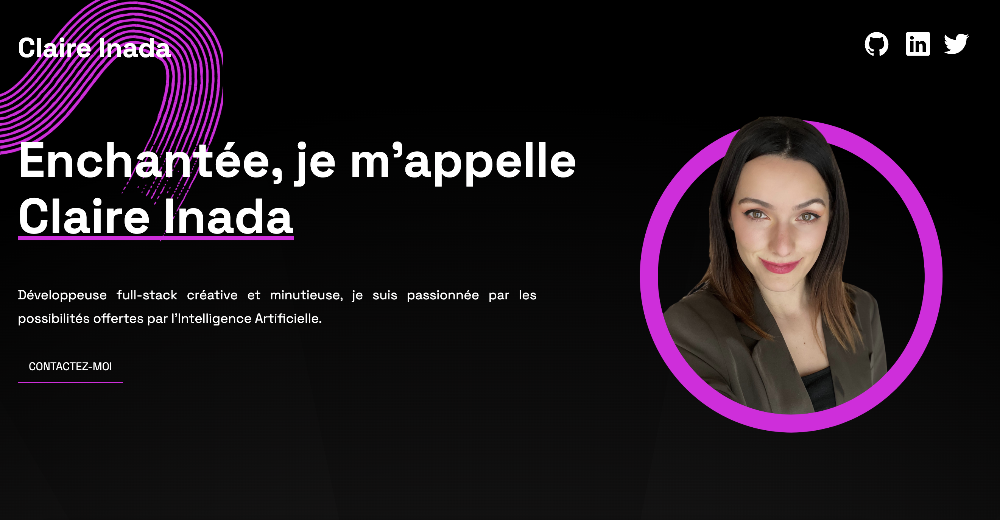

# Portfolio

Ceci est mon portfolio. Il comprend une courte présentation, la liste des technologies que j'utilise, mes projets récents, et un formulaire pour me contacter. 

 [**Link to project**](https://claireinada.netlify.app/)

## Comment je l'ai fait

**Technologies utilisées:** React

**Ressources utilisées:** 
- [icônes](https://react-icons.github.io/react-icons)
- [galerie de dégradés CSS](https://www.gradientmagic.com/)

## Ce que j'ai appris:

- [How to Scroll to an Element on click in React](https://bobbyhadz.com/blog/react-scroll-to-element-on-click)